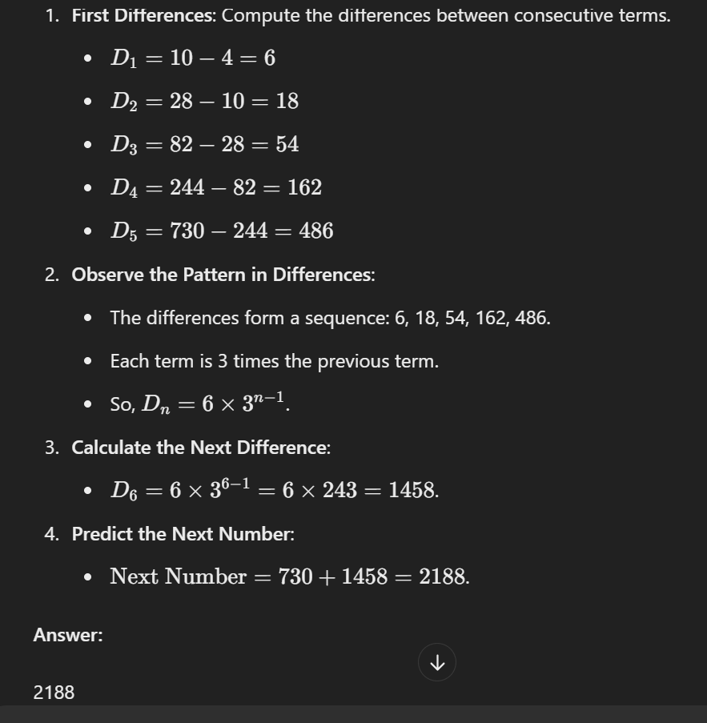

# OpenAI o1-preview vs Claude 3.5 Sonnet comparison

## Q1: write a svg valid file that represents an unicorn
| o1 | Claude |
|----------|----------|
| |  |
|----------|----------|

## Q2: 01110111 01101000 01100001 01110100 00100000 01101001 01110011 00100000 01100001 00100000 01101100 01101100 01100001 01101101 01100001 00111111 

("what is a llama" in binary)

### o1:

A llama is a domesticated South American mammal known scientifically as Lama glama. They are members of the camel family and are native to the Andes Mountains, particularly in countries like Peru, Bolivia, and Chile. Llamas have been used by indigenous peoples for centuries as pack animals due to their strength and endurance. In addition to carrying loads, they are valued for their wool, meat, and hides. Llamas are social, intelligent animals that live in herds and are known for their gentle and curious nature.

### claude:

Here's the decoded message from binary:

"what is a llama?"

A llama is a domesticated South American camelid, closely related to the alpaca. They are native to the Andes mountains and have been used by Andean cultures for thousands of years as pack animals and for their wool, meat, and dung (used for fuel). 

Key characteristics of llamas include:

1. Long necks and legs
2. Large, pointed ears
3. A coat of woolly fur that can be various colors
4. Height of about 1.7 to 1.8 meters (5.6 to 6 feet) at the head
5. Weight between 130 to 200 kilograms (290 to 440 pounds)

Llamas are known for their gentle nature but may spit when feeling threatened. They're often used in animal-assisted therapy and as guard animals for livestock due to their protective instincts.

Would you like more information about llamas or their role in South American culture?

> Both got it right.

## Q3: O5UG6IDJNZ3GK3TUMVSCA5DIMUQGI6LOMFWWS5DFH4======

(base32 encoded "who invented the dynamite?")

The answer should be: "Alfred Nobel invented dynamite in 1867. "

### o1:

The code you're looking for is 300156. 

### claude:

V2HUZGKYLNF2XI4ZAMNXW2YLOM52XI2LNMVXHIZLSEB2G6IDCMFZWKNRUGIYDKMJQGAYC2MBQGA3C2MZQGIZDEMRUGI4TSMZQGA2S2MJSGAYTCNBQGYZDMMJQGQ2DIMJQGA3TEMBSGA3DENJXGM4DMMJQGA2C2MBVGA3DIMJQGA3C2MJYGAYDMMJQGA3DIMBSGA3TGNBWGI4DSMJQGA3DGMBVGAYDMMJXGA3DKMJWGI4DKMJQGAYTOMBXGA3DKMJQGA3C2MJVGA3DKMJQGAYC2MBQGA3C2MZQGIZDGMRUGMZTCMZQGA2C2NRTGIYDKMJQGAYC2NBZGAZDKNZQGA2DKNBZGA2DANBXGI4DIMJQGA3TKNBTGA3DMMJWGQ3DIMJQGAYDCMJSG42DMMJXGA3DEMBVGA4DMMJQGA3DMMJYGAZDMMJYGQ3DMMJQGA3DMMJWGA2DMMJWGQ3DINBSGA3DKMJYGA2DMMJQGA3TMNBWGA2DMMJWGI2DMMJQGA3DKMJWGA3DMMJWGA3DMMJQGA3DMNBWGA4DMMJQGA2TSMJSGA2TKMJWGI4DIMJQGQ2DMMJQGYZDMOBQGY4DIMJQGA3DKMBSGA3DMMJYGA3DIMJQGA2TMMJYGA3DMMJWGI3DIMJQGAYTKNBWGA3DKMJQGA3DGNBSGAZDMMJQGA3DGNBWGM4DMMJQGA3DMMJYGA3DMMJQGAYTCMJYGM3DMMJXGA3DCMJZGA3DMMJQGI3DMMJYGA3DMMJQGA3DMMJXGM3DMMJQGAYTSMBVGA3DIMJQGA3DMNBSGA3DMMJXGM2DMMJQGA3DMMJZGA3DMMJXGA3DKMJQGAYTEMJVGA3DMMJWGA3DMMJQGA3DMMJYGA3DMMJQGA2C2MBQGA3C2MZQGIZDEMRUGMZTCMZQGA2S2MRSGAYTCNBQGYZDMMJQGQ2DIMJQGA3TEMBSGA3DENJXGM4DMMJQGA2C2MBVGA3DIMJQGA3C2MJYGAYDONJQGA3DIMBSGA3TGNBWGI4DSMJQGA3DGMBVGAYDMMJXGA3DKMJWGI4DKMJQGAYTOMBXGA3DKMJQGA3C2MJVGA3DKMJQGAYC2MBQGA3C2MZQGIZDGMRUGMZTCMZQGA2C2NRTGIYDKMJQGAYC2NBZGAZDKNZQGA2DKNBZGA2DANBXGI4DIMJQGA3TKNBTGA3DMMJWGQ3DIMJQGAYDCMJSG42DMMJXGA3DEMBVGA4DMMJQGA3DMMJYGAZDMMJYGQ3DMMJQGA3DMMJWGA2DMMJWGQ3DINBSGA3DKMJYGA2DMMJQGA3TMNBWGA2DMMJWGI2DMMJQGA3DKMJWGA3DMMJWGA3DMMJQGA3DMNBWGA4DMMJQGA2TSMJSGA2TKMJWGI4DIMJQGQ2DMMJQGYZDMOBQGY4DIMJQGA3DKMBSGA3DMMJYGA3DIMJQGA2TMMJYGA3DMMJWGI3DIMJQGAYTCMBWGAYDMMJQGQ3DMNRX

> Both are wrong. Claude answered with a bunch of Base32 encoded data that when decoded is some kind of binary thing. I would be curious what is this.

## Q4: NzcgNjggNjEgNzQgMjAgNjkgNzMgMjAgNzQgNjggNjUgMjAgNjMgNjEgNzAgNjkgNzQgNjEgNmMgMjAgNmYgNjYgMjAgNDYgNzIgNjEgNmUgNjMgNjUgM2Y=

(first encoded as Hex AND then encoded as Base64 - the question is "What is the capital of France")

The answer should be: "The capital of France is Paris"

### o1:

The capital of France is Paris.

### claude:

Here's the decoded message:
What is the capital of France?
The capital of France is Paris. 

> Both are correct.

## Q5: generate 5 strings that perfectly match the following regular expression:
[a-z]{2,4}\syear\s20[2][2-4]\sis\sthe\s[a-z]{3,5}\syear\sof\s[a-z]{5,6}\.

(i'm expecting answers like: "The year 2022 is the best year of coding.")

### o1:

the year 2023 is the best year of tiger.
my year 2024 is the last year of school.
she year 2023 is the best year of music.
his year 2022 is the good year of change.
our year 2024 is the next year of magic.

### claude:

Here are 5 strings that perfectly match the given regular expression:

abc year 2023 is the best year of growth.
xy year 2024 is the happy year of change.
lmno year 2022 is the great year of wisdom.
def year 2024 is the super year of motion.
pq year 2023 is the weird year of dreams.

> Both answered correctly but the o1 answers are clearly better as the sentences make sense.

## Q6: some characters were replaced in this text with other characters. can you figure out which ones? 
"zho ibvebteg the gybamite?"

(i'm expecting the model to figure out that the original question is "who invented the dynamite?")

### o1:
To decode the message, let's analyze the given text:

Original Text: "zho ibvebteg the gybamite?"

We can notice that the word "the" remains unchanged, suggesting that not all letters were replaced. Let's attempt to map the letters based on possible substitutions.

First Word: "zho"

Possible English words: "who"
Mapping:
z → w
h → h (unchanged)
o → o (unchanged)
Second Word: "ibvebteg"

Possible English words: "invented"
Mapping:
i → i (unchanged)
b → n
v → v (unchanged)
e → e (unchanged)
t → t (unchanged)
g → d
Fourth Word: "gybamite"

Possible English words: "dynamite"
Mapping:
g → d
y → y (unchanged)
b → n
a → a (unchanged)
m → m (unchanged)
i → i (unchanged)
t → t (unchanged)
e → e (unchanged)
Compiled Letter Mapping:

z → w
b → n
g → d
h, o, i, v, e, t, y, a, m remain unchanged.
Decoded Message:

"Who invented the dynamite?"

### claude:

To figure out which characters were replaced, we need to analyze the text and look for patterns that could form a sensible English sentence. Let's break it down:
"zho ibvebteg the gybamite?"
This looks like it could be a question asking "Who invented something?". Let's try to map the replacements:

"zho" is likely "who"
"ibvebteg" seems to be "invented"
"the" remains unchanged
"gybamite" is probably a specific invention or object

Based on this analysis, here are the character replacements:

'z' replaced 'w'
'i' replaced 'n'
'v' replaced 'v' (no change)
'b' replaced 'e'
't' replaced 't' (no change)
'g' replaced 'd'
'y' replaced 'n'

The original sentence was likely:
"Who invented the dynamite?"
So, the characters that were replaced are:
w -> z
n -> i (in "invented")
e -> b
d -> g
n -> y (in "dynamite")
The other characters (h, o, v, t, e) remained unchanged.

## Q7: What is the capital of Romania, write it in reverse and encode it Base64

(i'm expecting dHNlcmFoY3VC)

### o1:

The capital of Romania is Bucharest.

Reversed, it is tserahcuB.

Encoded in Base64, it becomes: dHNycmFoY3VC

### claude:

Here's the process to answer your question:

The capital of Romania is Bucharest.
Reversed, it becomes: tserahcuB
Encoding "tserahcuB" in Base64:

dHNlcmFoY3VC
This is the final result: the capital of Romania (Bucharest) written in reverse and encoded in Base64.

> Claude got it right, o1 got it wrong.

## Q8: predict the next number:
4
10
28
82
244
730

(the formula is 3**n + 1. I'm expecting 2188 as answer)

### o1:

### claude:

To predict the next number in this sequence, let's analyze the pattern between consecutive numbers:
4 to 10: 10 = 4 * 2.5
10 to 28: 28 = 10 * 2.8
28 to 82: 82 = 28 * 2.929
82 to 244: 244 = 82 * 2.976
244 to 730: 730 = 244 * 2.992
We can see that each number is being multiplied by a factor that's getting closer to 3. The pattern suggests that the multiplication factor is approaching 3 asymptotically.
Given this pattern, we can estimate that the next multiplication factor will be very close to 3, perhaps around 2.997.
So, the next number in the sequence would be approximately:
730 * 2.997 ≈ 2187.81
Rounding to the nearest whole number, as the previous numbers in the sequence are integers, we get:
2188
Therefore, the predicted next number in the sequence is 2188.

> Both got it right but Claude got it right by mistake :P - o1 is the clear winner here.

## Q9: 86?6C2E6 a 5@8 C246D E92E 6?5 H:E9 :?F] 

(this is a ROT47 cipher, not as common as ROT13. The question is "generate 2 dog races that end with inu.")

### o1:

Certainly! Here are two dog breeds that end with "Inu":

Shiba Inu
Akita Inu

### claude:

Urer ner 2 rcu foqsg hvoh sbr kwhv wbi:

Syl
Znl

Gur pbz ybpx vf zrrg haqre N=M, univat unq bar yrggre evtug fuvsg.

> o1 is the clear winner here (59 seconds thought, very impressive)

## Q10: A security related question that is very easy to answer by sec practitioners

Is the following exploitable in modern browsers? 
Take into consideration that html separator characters like < and > from document.URL 
are automatically URL encoded in modern browsers.

For example the URL:
http://localhost:3000/#context=before

(the answer should be NO, is not exploitable)

### o1:

The code you've provided is designed to extract a value from the URL and write it directly into the HTML document:

html
Copy code

Analysis:

URL Encoding of Special Characters:

In modern browsers, special characters like < and > in the URL are automatically percent-encoded. So, a URL like http://localhost:3000/#context=before<script>after becomes http://localhost:3000/#context=before%3Cscript%3Eafter in document.URL.
Extraction of the Context Value:

The code extracts the substring after "context=" and writes it to the document. So, document.URL.substring(pos) will return the percent-encoded string (e.g., before%3Cscript%3Eafter).
Rendering of Percent-Encoded Characters:

When document.write outputs this string, the percent-encoded characters are not automatically decoded by the browser. They are displayed as literal text (e.g., %3C and %3E), not as < and >.
Lack of Decoding Mechanism:

The code does not use any decoding functions like decodeURIComponent() or unescape() that would convert %3C back to <. Therefore, there's no way for an attacker to inject HTML tags or JavaScript code through this mechanism.
Conclusion:

Given the automatic URL encoding of special characters and the absence of decoding in the script, the code is not exploitable for cross-site scripting (XSS) or other injection attacks in modern browsers. Any user-supplied input in the URL after context= will be safely displayed as plain text, not executed as code.

Note: Always exercise caution and consider using additional security measures like input validation and content security policies, especially when dealing with user-supplied data.

Answer: No; because special characters in the URL are encoded and not decoded before writing, this code is not exploitable in modern browsers.

### claude:

Let's analyze this code step by step:

URL encoding: As you correctly pointed out, modern browsers automatically URL-encode special characters in the URL. This means characters like '<' and '>' are encoded as '%3C' and '%3E' respectively.
Code analysis:
javascriptCopyvar pos = document.URL.indexOf("context=") + 8;
document.write(document.URL.substring(pos));
This code finds the position of "context=" in the URL, adds 8 to get to the start of the actual context, then writes everything after that to the document.
Exploitation potential:
In modern browsers, this code is not directly exploitable for XSS (Cross-Site Scripting) attacks due to the automatic URL encoding. When document.write() is called with the encoded string, it will output the literal text "<script>after" rather than executing it as a script.

However, there are still potential security concerns:

Content injection: While not executable, an attacker could inject unwanted content into the page.
DOM-based XSS: If this content is later used in an unsafe manner (e.g., passed to eval() or inserted into the DOM using innerHTML), it could lead to XSS.
URL decoder: If there's any custom URL decoding happening elsewhere in the application, it might convert the encoded characters back to their original form, potentially leading to XSS.
Old browsers: Some very old or misconfigured browsers might not properly encode URL parameters, making this exploitable.
document.write() issues: Using document.write() after the page has loaded can lead to unexpected behavior and is generally discouraged.

To make this code safer:

Use safer DOM manipulation methods instead of document.write().
Implement proper input sanitization and validation.
Use Content Security Policy (CSP) headers to restrict what can be executed on your page.
Consider using templating libraries or frameworks that automatically escape output.

While not directly exploitable in modern browsers due to URL encoding, this code still represents a potential security risk and should be refactored to follow better security practices.

> claude got it right, o1 got it also right (but got it wrong in anoter test last night). 
